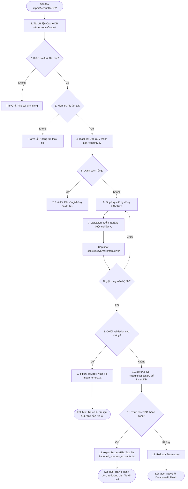

# Luồng Xử Lý Import Nhân Viên (Account) từ File CSV

Tài liệu này mô tả chi tiết luồng xử lý kỹ thuật và nghiệp vụ khi thực hiện nhập dữ liệu (Import) danh sách nhân viên từ file `account.csv` vào cơ sở dữ liệu trong hệ thống Quản lý Công ty (Kiến trúc 3 lớp kết hợp Generic).

---

## 1. Sơ đồ luồng xử lý (Mermaid Diagram)

Dưới đây là sơ đồ chi tiết các bước xử lý từ khi người dùng cung cấp đường dẫn file cho đến khi hoàn thành hoặc rollback:



---

## 2. Các lớp tham gia vào luồng xử lý

| Lớp/Interface | Gói (Package) | Vai trò chính |
| :--- | :--- | :--- |
| **`AccountServiceImplement`** | `com.zalo.auto.backend.service.impl` | Khởi tạo dữ liệu đệm (Cache DB), đóng gói vào `AccountContext` và kích hoạt luồng import. |
| **`AccountContext`** | `com.zalo.auto.dto.context` | Lưu trữ dữ liệu đệm từ database (Email, Phòng ban, Chức vụ) và map theo dõi trùng lặp email nội bộ file CSV. |
| **`IImportFile`** | `com.zalo.auto.backend.service` | Interface generic định nghĩa khung quy trình import chuẩn (`readFile`, `validation`, `saveAll`, `exportFileError`). |
| **`AccountCsvImport`** | `com.zalo.auto.backend.service.csv` | Lớp triển khai cụ thể các phương thức xử lý đọc, xác thực và ghi file liên quan đến Account. |
| **`AccountCsv`** | `com.zalo.auto.dto.csv` | DTO ánh xạ cấu trúc của một dòng dữ liệu từ file CSV kèm theo số dòng (`lineNumber`). |
| **`AccountRepositoryImplement`**| `com.zalo.auto.backend.repository.impl` | Thực hiện lưu trữ danh sách thực thể `Account` vào cơ sở dữ liệu thông qua JDBC Transaction (Batch Insert). |

---

## 3. Chi tiết các bước thực thi

### Bước 2.1: Tải dữ liệu đệm vào Context (`importAccountToCSV`)
Trước khi đọc file CSV, hệ thống truy vấn toàn bộ dữ liệu hiện có trong DB để phục vụ kiểm tra trùng lặp và liên kết khóa ngoại. Điều này tránh việc truy vấn DB lặp đi lặp lại ở mỗi dòng dữ liệu (giảm tải tối đa cho DB):
1. **Tìm tất cả Accounts hiện tại**: Chuyển đổi thành map key viết thường (`mapAccountByEmail`).
2. **Tìm tất cả Departments & Positions** trong hệ thống.
3. Tạo đối tượng `AccountContext` để chuyển giao cho bộ xác thực.

### Bước 2.2: Đọc file CSV (`readFile`)
1. Mở kết nối đọc file bằng `BufferedReader` và `FileReader`.
2. Bỏ qua dòng tiêu đề đầu tiên (`header`).
3. Đọc từng dòng tiếp theo, phân tách bằng dấu phẩy `,`.
4. Yêu cầu tối thiểu mỗi dòng phải chứa đầy đủ thông tin ứng với 5 cột dữ liệu:
   * Cột 1: `email`
   * Cột 2: `password`
   * Cột 3: `fullName`
   * Cột 4: `departmentId` (Mã hoặc Tên phòng ban)
   * Cột 5: `positionId` (Mã hoặc Tên chức vụ)
5. Tạo đối tượng `AccountCsv` chứa dữ liệu thô và chỉ số dòng thực tế (`lineNumber`).

### Bước 2.3: Xác thực dữ liệu nghiệp vụ (`validation`)
Đối với mỗi dòng dữ liệu thô (`AccountCsv`), hàm xác thực thực hiện lần lượt các bài kiểm tra:

1. **Xác thực Email**:
   * Không được để trống.
   * Không được trùng lặp với các dòng trước đó trong chính file CSV (`csvEmailsMapLower`).
   * Không được trùng lặp với Email đã tồn tại trong Database (`mapAccountByEmail`).
2. **Xác thực Mật khẩu & Họ tên**: Không được để trống.
3. **Xác thực Phòng ban (`departmentId` hoặc `departmentName`)**:
   * Thử chuyển đổi chuỗi sang kiểu số `int` để đối chiếu với `departmentId` trong DB.
   * Nếu không phải là số (ví dụ: "phòng hành chính"), đối chiếu không phân biệt chữ hoa/thường với `departmentName` trong DB.
   * Nếu không tìm thấy phòng ban nào khớp -> Báo lỗi `"Phòng ban không tồn tại trong hệ thống"`.
4. **Xác thực Chức vụ (`positionId` hoặc `positionName`)**:
   * Thử chuyển đổi chuỗi sang kiểu số `int` để đối chiếu với `positionId` trong DB.
   * Nếu không phải là số (ví dụ: "Dev"), đối chiếu không phân biệt chữ hoa/thường với tên chức vụ (`positionName`) trong DB.
   * Nếu không tìm thấy chức vụ nào khớp -> Báo lỗi `"Chức vụ không tồn tại trong hệ thống"`.

> [!NOTE]
> Khi tất cả các bước xác thực của dòng đều hợp lệ:
> - Một thực thể `Account` được khởi tạo: `new Account(0, email, password, fullName, MatchedDept, MatchedPos, LocalDate.now())` và đưa vào danh sách chờ lưu (`entityList`).
> - Email của dòng này được đưa vào map theo dõi trùng lặp của Context (`csvEmailsMapLower`).

---

## 4. Cơ chế xử lý lỗi và Rollback (Tính toàn vẹn dữ liệu)

Hệ thống tuân thủ nghiêm ngặt nguyên lý **"All or Nothing" (Tất cả hoặc không có gì)** để đảm bảo tính nhất quán của cơ sở dữ liệu:

### A. Nếu có bất kỳ lỗi xác thực nào xuất hiện trong file CSV:
* Ngay lập tức hủy bỏ tiến trình import (không gọi hàm ghi dữ liệu xuống database).
* Xuất toàn bộ chi tiết lỗi đã thu thập được ra file `import_errors.txt` đặt cùng thư mục với file import.
* Định dạng file lỗi:
  ```text
  ====== DANH SÁCH LỖI IMPORT ACCOUNT ======
  Line 3: 'nguyen.van.a@gmail.com' -> Lỗi: Email đã tồn tại trong database
  Line 5: 'phong kế toán' -> Lỗi: Phòng ban không tồn tại trong hệ thống
  ```
* Trả về thông báo lỗi kèm đường dẫn tuyệt đối của file `import_errors.txt`.

### B. Nếu toàn bộ dữ liệu hợp lệ:
1. Hệ thống thực hiện gọi `accountRepository.createAccounts(entityList)`.
2. Lớp repository sử dụng cơ chế **JDBC Transaction (Batch Update)**:
   * Thiết lập `connection.setAutoCommit(false)`.
   * Thực hiện add batch các câu lệnh insert của danh sách nhân viên mới.
   * Thực thi `executeBatch()`.
   * Gọi `connection.commit()` để hoàn tất lưu trữ.
3. Nếu phát hiện lỗi cơ sở dữ liệu trong quá trình lưu (ví dụ: kết nối lỗi, lỗi ràng buộc DB...):
   * Thực hiện `connection.rollback()` toàn bộ các bản ghi trước đó.
   * Trả về thông báo lỗi hệ thống.
4. Nếu lưu thành công hoàn toàn:
   * Tạo file báo cáo kết quả `imported_success_accounts.txt` đặt cùng thư mục với file import.
   * Trả về thông báo thành công kèm đường dẫn tuyệt đối của file kết quả.

---

## 5. Chức năng chi tiết của các file liên quan trong quá trình import

Dưới đây là mô tả chi tiết nhiệm vụ và trách nhiệm cụ thể của từng file mã nguồn trong toàn bộ luồng xử lý:

### 1. `AccountFunction.java` (Lớp giao diện người dùng - View)
* **Nhiệm vụ**: Tương tác trực tiếp với người dùng qua console.
* **Chức năng**:
  * Hiển thị menu cho người dùng lựa chọn chức năng nhập dữ liệu (lựa chọn 6).
  * Nhận đầu vào là đường dẫn file `.csv` (ví dụ: `account.csv`).
  * Gọi phương thức `importAccountToCSV(path)` của Controller và in thông báo phản hồi (thành công hoặc lỗi kèm đường dẫn file kết quả).

### 2. `AccountController.java` (Lớp điều phối - Controller)
* **Nhiệm vụ**: Tiếp nhận yêu cầu từ View và chuyển tiếp cho Service.
* **Chức năng**:
  * Đóng vai trò là đầu mối trung gian giữa giao diện giao tiếp và tầng xử lý nghiệp vụ.
  * Gọi trực tiếp phương thức xử lý logic của `AccountServiceImplement`.

### 3. `AccountServiceImplement.java` (Lớp nghiệp vụ - Service)
* **Nhiệm vụ**: Chuẩn bị dữ liệu môi trường (Context) và kích hoạt nghiệp vụ import.
* **Chức năng**:
  * Truy vấn cơ sở dữ liệu để lấy danh sách tài khoản, phòng ban, chức vụ hiện có (sử dụng Repository).
  * Đóng gói thông tin này vào `AccountContext` để làm bộ nhớ đệm (Cache).
  * Khởi tạo đối tượng `AccountCsvImport` để bắt đầu thực thi.

### 4. `IImportFile.java` (Mẫu thiết kế Generic - Interface)
* **Nhiệm vụ**: Định nghĩa cấu trúc chuẩn cho hành vi nhập file.
* **Chức năng**:
  * Định nghĩa các phương thức trừu tượng: `readFile()`, `validation()`, `saveAll()`, `exportFileError()`.
  * Cung cấp phương thức mặc định (`default String importFile`) để làm chuẩn khung xương (Template) xử lý chung cho mọi loại file CSV (Account, Department, v.v.).

### 5. `AccountCsvImport.java` (Lớp thực thi nghiệp vụ Import - Csv Import Service)
* **Nhiệm vụ**: Triển khai chi tiết các công đoạn đọc, xác thực và xuất báo cáo file.
* **Chức năng**:
  * **`readFile`**: Sử dụng `BufferedReader` và `FileReader` để phân tách từng dòng trong file CSV thành DTO `AccountCsv`.
  * **`validation`**: Kiểm tra tính hợp lệ của từng bản ghi, thực hiện khớp nối ID/Tên phòng ban và chức vụ từ cache, bắt lỗi trùng lặp.
  * **`saveAll`**: Chuyển danh sách thực thể `Account` hợp lệ xuống tầng repository để lưu vào DB.
  * **`exportFileError` / `exportSuccessFile`**: Đọc/ghi file hệ thống để sinh ra báo cáo lỗi (`import_errors.txt`) hoặc báo cáo thành công (`imported_success_accounts.txt`).

### 6. `AccountContext.java` (Lớp chứa ngữ cảnh - Context Cache)
* **Nhiệm vụ**: Tối ưu hiệu năng xác thực bằng cách lưu trữ dữ liệu đệm.
* **Chức năng**:
  * Giảm thiểu truy vấn database (tránh lỗi N+1 queries).
  * Chứa danh sách phòng ban, chức vụ và map các email hiện tại trong hệ thống.
  * Duy trì map nội bộ (`csvEmailsMapLower`) để theo dõi các email đã được duyệt qua trong file CSV hiện tại, tránh trùng lặp chéo giữa các dòng trong cùng một file.

### 7. `AccountCsv.java` (Đối tượng truyền dữ liệu từ CSV - DTO)
* **Nhiệm vụ**: Biểu diễn cấu trúc thô của dữ liệu từ file CSV.
* **Chức năng**:
  * Chứa 5 trường thông tin dạng chuỗi (`String`) tương ứng với 5 cột trong file `account.csv`.
  * Lưu giữ thuộc tính số dòng (`lineNumber`) giúp việc định vị và báo cáo dòng bị lỗi chính xác.

### 8. `ImportError.java` (Đối tượng chứa lỗi - Error DTO)
* **Nhiệm vụ**: Đóng gói chi tiết lỗi xác thực dữ liệu.
* **Chức năng**:
  * Lưu trữ thông tin: dòng lỗi, giá trị nhập sai và mô tả lỗi chi tiết.
  * Cung cấp hàm `toString()` chuẩn hóa định dạng hiển thị trong file báo cáo lỗi.

### 9. `Account.java` (Thực thể dữ liệu - Entity)
* **Nhiệm vụ**: Biểu diễn mô hình dữ liệu ánh xạ trực tiếp đến cơ sở dữ liệu.
* **Chức năng**:
  * Là đối tượng đích cuối cùng chứa thông tin chuẩn hóa để lưu xuống database.
  * Chứa các liên kết thực sự tới thực thể phòng ban (`Department`) và chức vụ (`Position`) sau khi đã xác thực và tìm kiếm thành công từ context.

### 10. `AccountRepositoryImplement.java` (Lớp truy cập dữ liệu - Repository)
* **Nhiệm vụ**: Tương tác trực tiếp với cơ sở dữ liệu qua JDBC.
* **Chức năng**:
  * Thực thi phương thức `createAccounts(List<Account> entityList)` bằng cách chèn hàng loạt (Batch Insert).
  * Quản lý kết nối Database Transaction (`setAutoCommit(false)`, `commit()`, `rollback()`) đảm bảo tính toàn vẹn dữ liệu.
